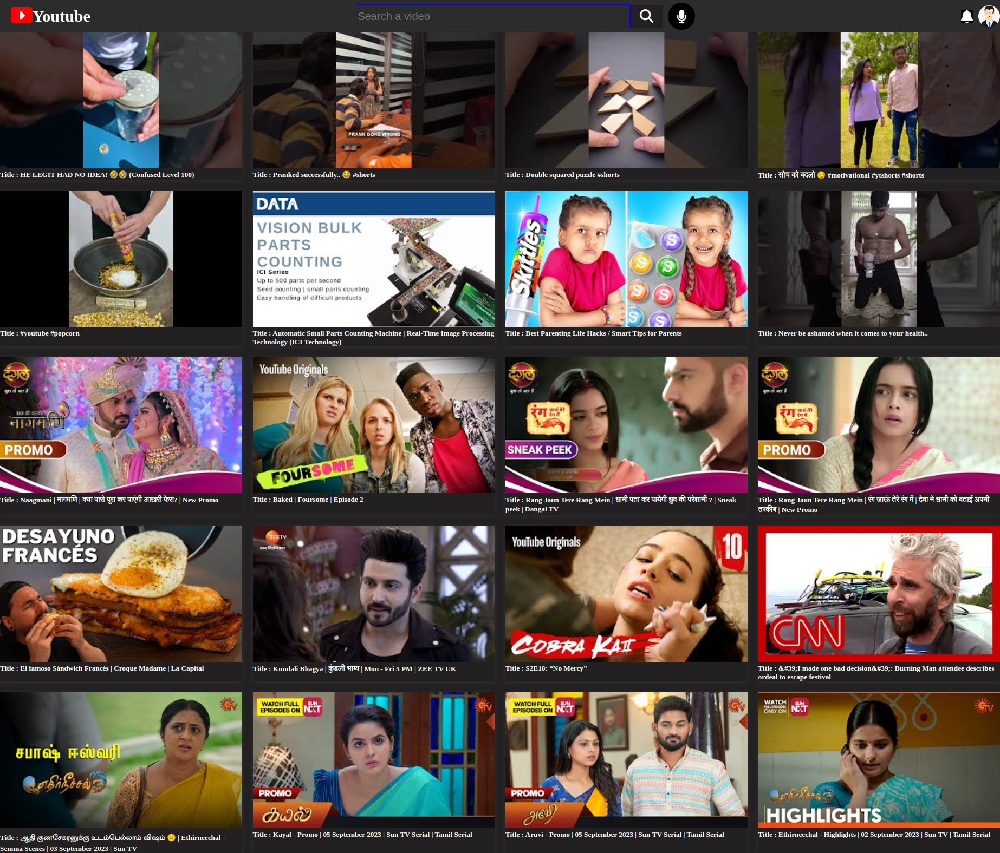
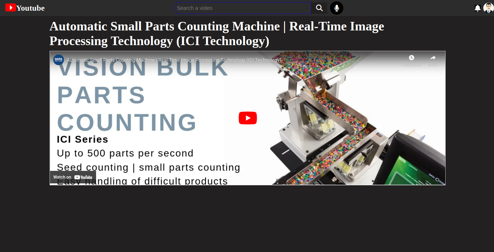

# YouTube Clone

**This is the clone of the Youtube Web APP. YouTube is a website for sharing videos. It was registered on February 14, 2005, by Steve Chen, Chad Hurley, and Jawed Karim, three former employees of the American e-commerce company PayPal. They had the idea that ordinary people would enjoy sharing their “home videos.” The company is headquartered in San Bruno, California. Shortly after the site opened on a limited (“beta”) basis in May 2005, it was attracting some 30,000 visitors per day.**

**To see the Demo Video of Website click the below link.**
[Demo Link](https://youtube-search-app120.netlify.app/youtube.html)

## Team Members
> ## Github :- •[Arvind Maurya](https://github.com/MB7232SP)

## Built with

<ul>
  <li>HTML</li>
  <li>CSS</li>
  <li>JavaScript</li>
  <li>Local Storage</li>
</ul>

## Features

<ul>
  <li>User can search any youtube video with title name.</li>
  <li>User can watch any youtube video by clicking on the video.</li>
</ul>

## Some screenshots of the project :-

## Home Page

## Video Play Page

### Thanks for Reading.